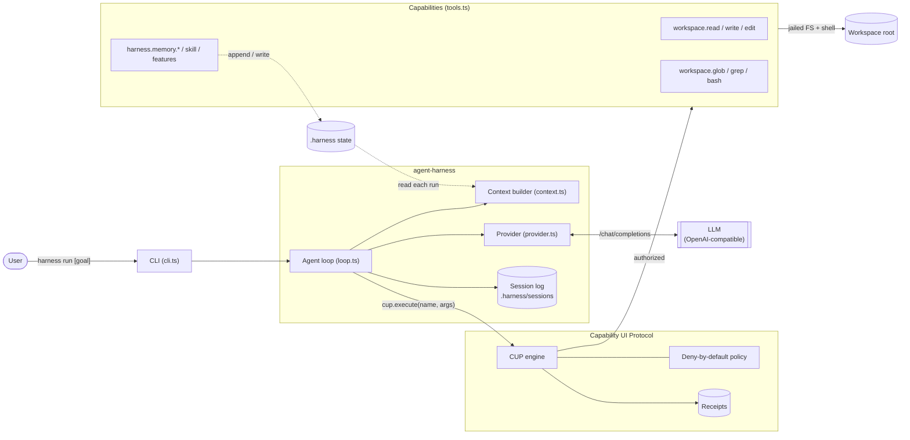
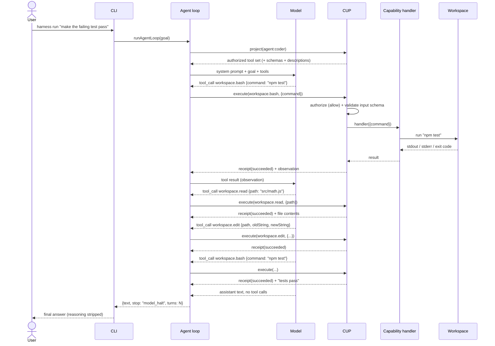
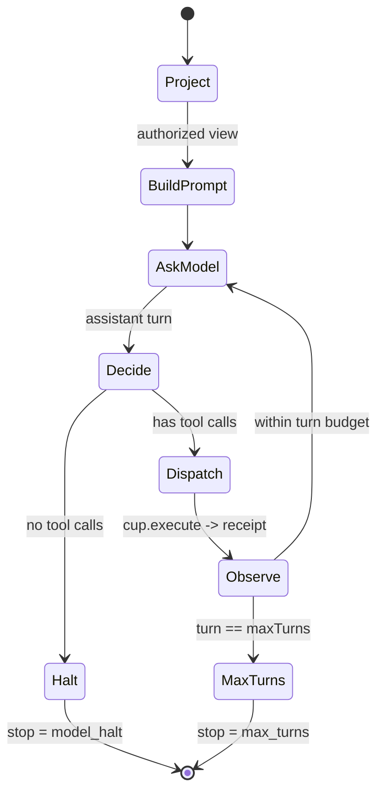
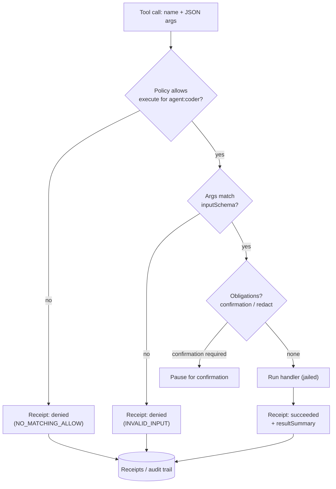
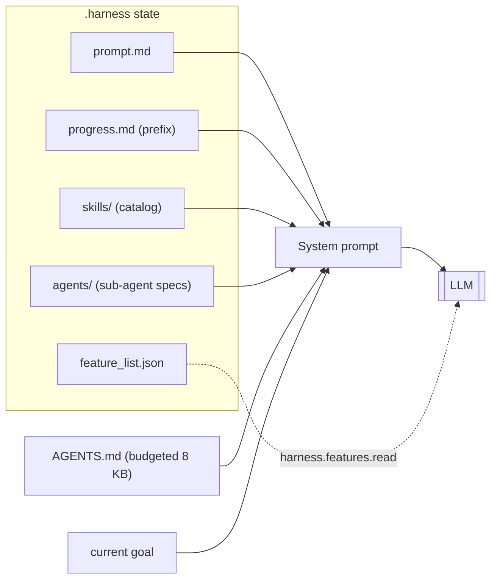
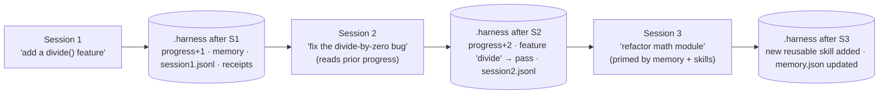
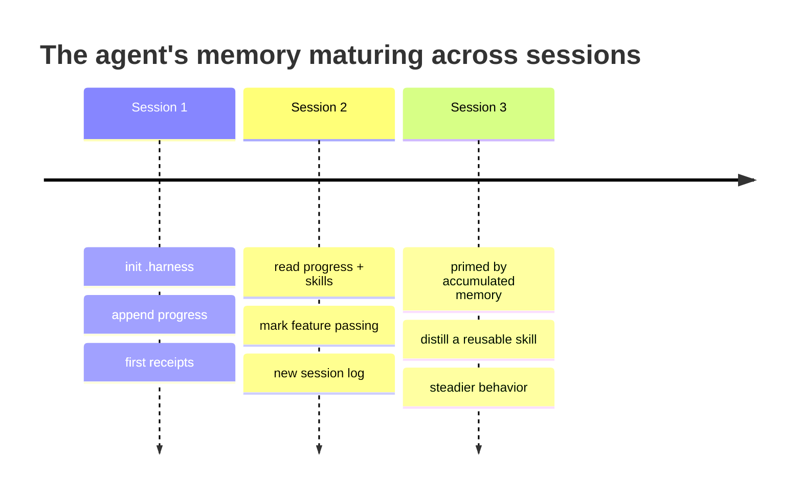
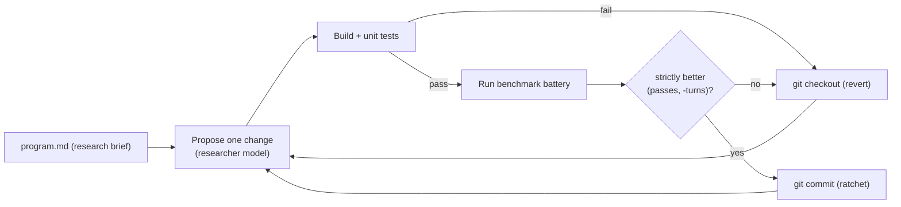

# The agent via CUP: a worked example

This walkthrough shows **how the agent works on a single goal** and **how it evolves
across sessions** as a user keeps working in the same workspace. Every tool call the
model makes is mediated by the [Capability UI Protocol (CUP)](https://github.com/Capability-UI/Capability-UI):
CUP decides *whether* a call is allowed, runs the handler, and emits a **receipt**.
The harness owns the loop, the context it feeds the model, and the durable
`.harness/` state that accumulates over time.

> The diagrams below are [Mermaid](https://mermaid.js.org/) and render on GitHub.

---

## 1. The system at a glance



The model never touches the filesystem directly. It emits **tool calls**; the loop
routes each one through `cup.execute`, and only capabilities the `agent:coder`
subject is authorized for can run.

---

## 2. One goal, one run

Scenario: a user runs

```bash
OPENAI_API_KEY=... npx harness run "make the failing test pass" --workspace .
```



### The loop as a state machine



To keep context bounded, only the last **5** tool observations
(`KEEP_LAST_FULL_OBSERVATIONS`) are replayed in full; older ones are masked.
Observations larger than 32 KB (`OBSERVATION_CHAR_CAP`) spill to a workspace
artifact path the agent can re-read.

---

## 3. How CUP authorizes every tool call

Each `cup.execute` is an authorization decision, not just a function call:



Because the policy is **deny-by-default**, the agent cannot invent a tool it was
not granted (e.g. a call to `workspace.rmrf` is denied), and every attempt —
allowed or denied — leaves a receipt.

---

## 4. What the model sees each turn

The system prompt is re-assembled from the durable `.harness/` state on every run,
which is the mechanism by which the agent "remembers":



Skills are listed by **name + description only**; the agent pulls a full skill body
on demand with `harness.skill.read`. This keeps the prompt small while making
accumulated know-how discoverable.

---

## 5. A concrete transcript

A trimmed view of the run above (`stop=model_halt turns=5`):

```text
system  : You are a coding agent... ## Goal: make the failing test pass ...
user    : make the failing test pass
assistant  -> tool workspace.bash   {"command":"npm test"}
tool    : 1 failing — add(2,3) expected 5, got -1   (receipt r1: succeeded)
assistant  -> tool workspace.read   {"path":"src/math.js"}
tool    : export function add(a,b){ return a - b; }  (receipt r2: succeeded)
assistant  -> tool workspace.edit   {"path":"src/math.js",
                                      "oldString":"return a - b;",
                                      "newString":"return a + b;"}
tool    : edited 1 occurrence                        (receipt r3: succeeded)
assistant  -> tool workspace.bash   {"command":"npm test"}
tool    : all tests pass                             (receipt r4: succeeded)
assistant  -> tool harness.memory.append_progress
                                     {"text":"Fixed add(): was subtracting."}
tool    : progress updated                           (receipt r5: succeeded)
assistant : Done — add() now adds and the suite passes.
```

Receipts `r1..r5` are the audit trail for this run; the `append_progress` call is
what carries knowledge into the *next* run.

---

## 6. Evolution over time

As the same user keeps working in the workspace, `.harness/` grows and each new run
starts from a richer context. Nothing about the model changes — the **harness state
around it** does.





What accumulates, and how:

| State | Written by | Read back into the next run |
| --- | --- | --- |
| `progress.md` | `harness.memory.append_progress` | Injected as the progress prefix in the system prompt |
| `memory.json` | `harness.memory.write_json` | Available via `harness.memory.read` |
| `skills/` | user or agent (Markdown) | Listed in the prompt; bodies via `harness.skill.read` |
| `feature_list.json` | the workflow | Consulted via `harness.features.read` before claiming success |
| `sessions/*.jsonl` | the loop | Durable audit of every turn |
| CUP receipts | `cup.execute` | Durable authorization/audit trail |

The result is a **ratchet of context**: each session's progress notes, features,
and skills make the following session better-informed — while CUP keeps every step
inside the same policy boundary and records it.

---

## 7. Improving the harness itself

The same evaluate-then-keep discipline is applied to the harness's own code by the
autoresearch loop under [`research/`](../research): propose one change, build, run
the unit tests and a benchmark, and keep the change only if the metric strictly
improves — otherwise revert.



See the [README](../README.md) for the batteries (including the real HumanEval,
HumanEval+, and MultiPL-E TypeScript benchmarks) and how to run the loop.
