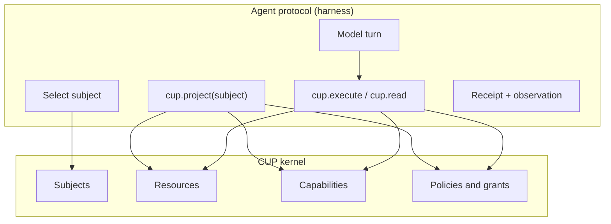

# CUP resources, subagents, and the agent protocol

**Date:** 2026-09-08
**Status:** implementation-ready (v1.5 / former v2 slice)
**Repos:** `agent-harness` (this plan), Capability UI Protocol as the kernel
**Depends on:** [2026-09-07-001-plan-capability-ui-harness.md](2026-09-07-001-plan-capability-ui-harness.md), [llm-agent-harness-research.md](../llm-agent-harness-research.md), [agent-via-cup.md](../agent-via-cup.md)

This plan does three things:

1. Treat **every artifact an agent creates** as a CUP resource with **strict, deny-by-default policies**.
2. Make **subagents first-class CUP subjects**: saved system prompts, **subject-specific memory**, and **CUP-managed capability and resource grants**. Subagents are reused by launching new sessions as the same subject, not by pasting a prompt into the parent.
3. State how the **agent protocol uses CUP** as an **operating model** for giving any worker (root coder or subagent) a specific, attenuated set of capabilities.

v1 already routes tool calls through `cup.execute` for a single `agent:coder` subject. Files, skills, memories, and `.harness/agents/*.md` are still **disk objects**, not CUP resources. Sub-agent specs are listed in the prompt and cannot spawn. Memory is shared. This plan closes that gap.

## Settled decisions

| Decision | Choice | Why |
| --- | --- | --- |
| CUP role | Operating model, not a tool wrapper | Identity, catalog, verbs, grants, and receipts are CUP. The harness owns the loop, context projection, workspace jail, and persistence of CUP state to `.harness/cup/`. Policy never lives only in the system prompt. |
| Created work | Register a CUP `data` (or `agent`) resource on **create**; bump `version` on update | User requirement: anything the agent creates is a resource. Without this, `project()` cannot hide ungranted files and subagents cannot be scoped. |
| File verbs | Keep ACI capabilities (`workspace.read` / `write` / `edit` / …). Bind them with **grants + host conditions**, not a new tool zoo | Vercel / Anthropic: few general tools. CUP already has `execute` on capabilities plus `read` on data resources. Path attenuation is a grant, not a new capability id per folder. |
| Scope matching | Host-compiled **path-prefix and resource-id grants**. Do not wait on CUP prefix-scope syntax | CUP `matchesScope` is exact key equality today. Conditions (`Policy.conditions`) can enforce prefixes in-process. Persist grants as JSON; rebuild policies on host boot. Optional CUP enhancement (prefix scopes) is a follow-up in Capability-UI, not a blocker. |
| Default policy on create | Owner = creating subject. Sensitivity `confidential`. Creator: `discover`, `inspect`, `read`, `update`. **No** `delete` by default. **No** `principal: { type: 'agent' }` wildcards. Parent `agent:coder` gets `discover` + `inspect` only on child-created resources | Strict. Other subjects remain denied. Parent can see that work exists without automatically reading private subagent memory. |
| Privilege | Spawn and define **cannot escalate**. A subject may grant only capabilities and resources it currently holds | Classic attenuation. RLM / Continual Harness both require attenuated sub-calls (research synthesis). |
| Subagent identity | Stable `agent:<slug>` subject + CUP resource `harness.subagent.<slug>` of `type: 'agent'` | Matches CUP agent-neutrality. Reuse is "new session, same subject and prompt resource", not a new identity per spawn. |
| Memory | Per-subject store. Root: `.harness/memory.json` + `progress.md`. Subagent: `.harness/agents/<slug>/memory.json` + `progress.md`. `harness.memory.*` keys off `context.actorId` | Memories are subagent-specific. Shared memory is an explicit grant of the parent's memory resource, never the default. |
| Prompt reuse | Persist `SYSTEM.md` (system prompt) on the subagent resource. Every session for that slug loads it. Parent prompt is not copied into the child window except a bounded spawn brief | Continual Harness \(\mathcal{G}\) as data. LITMUS: prompt writes go through CUP `execute` with receipts. |
| Spawn shape | Nested `runAgentLoop` as the child subject. Parent sees a **summary + receipt id**, not the child's full transcript | Root context stays small (RLM lesson). Session jsonl still records the child run under the child subject. |
| Live Refiner | Still out of scope | Same as v1. Defining and editing subagents is worker-driven CRUD through CUP, not an automatic every-F-steps teacher. |
| CUP core code | **No required protocol change** for this milestone | Resources, subjects, operations, `project`, `execute`, `delegate`, receipts, and conditions already exist. Document the operating model in both repos. Optional later: serializable prefix scopes in Capability-UI. |

## CUP as the operating model

CUP answers **who may do which verb on which noun**, for every worker in the harness. It does not plan, compact, or sample tokens.

| CUP object | Operating-model role in the harness |
| --- | --- |
| `Subject` | The worker identity for this session: `agent:coder` or `agent:<slug>`. Never the CLI operator impersonated on tool calls. |
| `Resource` | A noun the worker may know about: a created file, a skill, a memory document, a subagent spec, a session log. |
| `Capability` | A verb: ACI tools, memory/skill tools, `harness.subagent.define`, `harness.subagent.spawn`. |
| `Policy` / grant | The assignment of verbs and nouns to a subject. This **is** how a subagent gets a specific capability set. |
| `project()` | The session catalog: tools + resource index the model is allowed to see. Advisory for the prompt; **not** the lock. |
| `execute` / `read` | The lock. Every model tool call is `cup.execute` as the acting subject. Fat file bodies prefer `cup.read` on the file resource or `workspace.read` that re-authorizes the path. |
| `Receipt` | Evidence. Create, spawn, grant, and memory writes all leave receipts. Child receipts use the child actor id. |

**Giving a subagent capabilities is a CUP compilation step**, not a prompt instruction:

1. Choose a **profile** (named bundle) or an explicit capability id list.
2. Choose **resource selectors** (file ids, path prefixes, memory ids).
3. Persist a **grant document** owned by the subagent resource.
4. On host boot or spawn, `policy.allow` only those tuples for `agent:<slug>`.
5. `cup.project({ subject: child })` is what the child model receives as tools.

The parent must not "pass its tool list" into the child. The child `project()` is computed from the child's policies. If a capability is missing from the grant, the child cannot invoke it even if it names the tool in text.



This is the same split already described in [agent-via-cup.md](../agent-via-cup.md), extended from one worker to many.

## How the agent protocol uses CUP

A **session** is: one acting subject, one goal, one turn budget, one jsonl log. The **harness** is a stateless loop over CUP plus `.harness` disk. The **context window** is a projection of the session, not the session itself.

### Session start

1. Host authenticates the operator (API key for the model). That identity is **not** the CUP subject.
2. Resolve acting subject:
   - default `agent:coder`
   - CLI `--agent <slug>` or parent `harness.subagent.spawn` -> `agent:<slug>`
3. `ensureHarnessLayout` plus **load CUP catalog** from `.harness/cup/` (resources + policies + grants). Register capabilities for this process.
4. `cup.project({ subject, goal, context: { purpose, channel: 'cli', workspace, actorId } })`.
5. Build system prompt from **that subject's** prompt resource, **that subject's** memory/progress prefix, skill **names** the subject may `discover`, and the authorized tool list. Do not inject another subject's memory.
6. Enter ReAct.

### Each tool-calling turn

1. Model emits `tool_call { name, arguments }`.
2. Loop calls `cup.execute({ subject, capability: name, input, purpose, context })`.
3. CUP: deny-by-default match, input schema, obligations, handler.
4. Host handler additionally enforces **path/resource grants** (conditions). A policy allow on `workspace.read` is not a license to read ungranted paths.
5. If the handler **creates** a new durable object, the host **registers a resource** and **installs strict default policies**, then includes the new resource id in the result summary.
6. Receipt is appended (CUP sink + session jsonl). Observation is capped/masked as in v1.
7. Denied calls return `status=denied` with a reason code. The model is not given a shadow API around CUP.

### Halt

Unchanged: model halt, max turns, future stop-hook on failing features. Child spawn returns `{ text, stopReason, sessionId, receiptId }` to the parent as the spawn capability's output.

### Why `project` is not enough

A compromised or confused model can name a tool that is not in the projected list. `execute` must still deny. Same for `workspace.read` of a path the child was never granted. UI, prompts, and tool lists are conveniences.

## Created work as CUP resources

### What counts as create

| Event | Resource type | Resource id | Disk |
| --- | --- | --- | --- |
| First `workspace.write` to a path | `data` | `ws.file:<posix-rel-path>` | the file |
| `workspace.edit` / overwrite existing | same id, bump `version` | same | the file |
| Skill file under `.harness/skills` or `skills/` | `data` | `harness.skill.<name>` | SKILL.md |
| Root memory / progress write | `data` | `harness.memory.agent:coder` / `harness.progress.agent:coder` | `.harness/memory.json`, `progress.md` |
| Subagent define | `agent` | `harness.subagent.<slug>` | `.harness/agents/<slug>/` |
| Subagent memory / progress | `data` | `harness.memory.agent:<slug>` / `harness.progress.agent:<slug>` | under that slug dir |
| Observation spill | `data` | `harness.artifact.<id>` | `.harness/artifacts/` |
| Session jsonl | `data` | `harness.session.<uuid>` | `.harness/sessions/` |

Bash that creates files is the hard case. v1 `workspace.bash` can `touch` outside the write tool. **Policy for this milestone:**

- Preferred path: agents use `workspace.write` / `edit` for durable work.
- `workspace.bash` remains granted only to subjects whose profile includes it (root coder; optional `tester` profile).
- After a successful bash whose grant includes `process_spawn`, run a **cheap create-reconciliation**: `glob` of workspace vs resource catalog for new files under the subject's allowed prefixes; register missing `ws.file:*` with the **acting subject** as owner. Cap the scan (for example only prefixes in the grant, or files newer than the spawn timestamp). Do not register the entire repo on every `ls`.

Pre-existing repo files are **not** auto-registered on `init`. They become resources when first touched by a create/update, or when the host offers `harness.resources.import_path` (root coder only) to opt a tree into the catalog. Untouched files stay reachable by `agent:coder` through existing ACI policy (root is the workspace operator). Subagents **never** inherit "whole workspace" by default.

### Strict default policies (create template)

On register of resource `R` created by subject `S`:

| Principal | Operations | Notes |
| --- | --- | --- |
| `S` | `discover`, `inspect`, `read`, `update` | Owner. No `delete`, `share`, `delegate` unless a later explicit grant. |
| `agent:coder` if `S !== agent:coder` | `discover`, `inspect` | Coordinator can see the name and schema, not the body, for private memory. File resources created by a child for the parent's task may add `read` if the spawn grant said `shareCreatesWithParent: true` (default **false** for memory, **true** for `ws.file:*` under granted prefixes). |
| anyone else | (none) | Deny by default. |

Never install `principal: { any: true }` or `principal: { type: 'agent' }` on created work.

Metadata to store: `createdBy`, `createdAt`, `path` or `slug`, `sensitivity: confidential`.

### Persistence

CUP's in-memory `CapabilityUI` dies with the process. Persist:

```
.harness/cup/resources.jsonl    # resource records (no handler functions)
.harness/cup/policies.jsonl     # allow/deny records (conditions as named ids, not raw JS)
.harness/cup/grants.jsonl       # subagent grant documents
```

On `createHarnessCup`, replay these into `cup.register` and `cup.policy.allow`. Named condition ids (`path_prefix`, `resource_in_grant`, `actor_owns`) are implemented in host TypeScript and attached when compiling policies. Do not serialize functions.

### `workspace.*` vs `cup.read`

Two layers, both required:

1. **Capability layer:** may this subject `execute` `workspace.read` at all?
2. **Resource layer:** may this subject `read` `ws.file:src/foo.ts`, or does the path match a granted prefix?

Handler algorithm for `workspace.read`:

1. CUP already allowed `execute`.
2. Normalize path in the jail.
3. If `ws.file:<path>` exists, `cup.authorize({ subject, operation: 'read', resource: that id, scope: { path } })`. Deny if deny.
4. Else (untouched file): allow only if the subject is `agent:coder` **or** a grant `pathPrefixes` covers the path. Subagent miss: deny `PATH_NOT_GRANTED`.
5. Then `workspace.readText`.

Writes:

1. Same path check for `update` on existing resources or `create` on new paths (new paths must fall under a granted prefix; root coder granted `**`).
2. Perform the filesystem write.
3. Register or version the resource; emit receipt via the outer `execute`.

This is how CUP manages which resources are available to a subagent: **the child `project()` lists granted file resources; the handlers refuse the rest.**

## Subagents

### Data layout

```
.harness/agents/<slug>/
  SYSTEM.md          # saved system prompt (the reusable persona)
  spec.md            # name, description, profile (YAML frontmatter + notes)
  grant.json         # capabilities, pathPrefixes, resourceIds, purpose, expiresAt?
  memory.json        # subject-specific structured memory
  progress.md        # subject-specific progress
```

CUP resource `harness.subagent.<slug>` (`type: 'agent'`) metadata points at these files. `read()` on that resource returns spec + prompt **if** the caller may `read` it. Child sessions load `SYSTEM.md` from disk in the host (context builder), still gated by the child being that subject.

Root `agent:coder` prompt stays `.harness/prompt.md`.

### Capability profiles (bundles)

Named bundles compile to capability id lists. Host-defined, not model-defined:

| Profile | Capabilities | Typical resources |
| --- | --- | --- |
| `read-only` | `workspace.read`, `glob`, `grep`, `harness.skill.read`, own `harness.memory.read` | granted files / prefixes |
| `editor` | `read-only` plus `workspace.write`, `workspace.edit` | same prefixes; creates shared with parent for `ws.file:*` |
| `tester` | `editor` plus `workspace.bash` | plus command risk; still jailed |
| `memory-only` | own memory read/write/progress | no workspace files |

Custom lists are allowed if every id is a subset of the **caller's** authorized capabilities.

### New capabilities

**`harness.subagent.define`** (root coder; later a subject with explicit allow)

Input: `slug`, `description`, `systemPrompt`, `profile` or `capabilities[]`, `pathPrefixes[]`, `resourceIds[]`, optional `purpose`.

Effects: write the slug directory; register agent resource; write `grant.json`; compile policies for `agent:<slug>`; create empty memory/progress resources owned by the child. Receipt. Idempotent overwrite of prompt/grant if the caller may `update` that subagent resource (version bump).

**`harness.subagent.spawn`**

Input: `slug`, `goal`, optional `maxTurns`, optional **extra** `resourceIds` / prefixes (must already be held by the caller; merged for this session only **or** refused if we want grants immutable per session: **choose session-immutable grants**. Extra resources for one spawn must be a **session grant** with `expiresAt` when the child loop ends, implemented as `cup.delegate` or a temporary policy with expiry. Prefer `cup.delegate` for extra capabilities so expiration is native.)

Effects: nested `runAgentLoop` with child subject, child prompt, child memory. Parent messages get the child summary only.

**`harness.subagent.list` / read spec** can be `cup.project` + `cup.read` on agent resources; a thin capability is optional. Prefer `project()` so the catalog is CUP-native.

### CLI reuse (new session, same subagent)

```
harness run --agent reviewer "re-check the auth module"
harness tools --agent reviewer
```

`--agent reviewer` sets the acting subject to `agent:reviewer`, loads `SYSTEM.md` and that slug's memory, and `project()`s that subject's tools. This **is** reuse: durable prompt + durable memory + durable grants; fresh session jsonl and goal.

Root:

```
harness run "define a reviewer subagent and spawn it on src/auth"
```

uses `define` then `spawn` inside one parent session.

### Nested loop constraints

- Child turn budget default: min(parent remaining, 12) unless specified.
- Child cannot `harness.subagent.define` or `spawn` in v1.5 unless profile `coordinator` is added later (out of scope). Prevents spawn bombs.
- Child `harness.memory.*` only hits `agent:<slug>` stores.
- Parent memory tools never read child `memory.json` unless a policy allow exists (default no).
- Same observation cap and masking.
- Provider/model: inherit parent model config unless spec metadata overrides (optional, default inherit).

### Attenuation and delegation

Two mechanisms, both CUP:

1. **Standing policies** from `grant.json` (the operating assignment).
2. **Session `delegate()`** from parent to child for extra execute rights that expire when spawn returns.

`delegate` requires the parent to hold `delegate` on that capability. Add `cup.policy.allow` for `agent:coder` on `delegate` for the ACI capabilities it may lend. Subagents do not get `delegate` by default.

## Context assembly changes

`buildSystemPrompt` today injects a global skill list, global subagent spec list, and global progress. Change to **subject-scoped**:

- Prompt body: child `SYSTEM.md` or root `prompt.md`.
- Progress prefix: that subject's `progress.md` only.
- Skills: only skills the subject may `discover`.
- Subagents: only listed for subjects that may `discover` `harness.subagent.*` (root). Children get no subagent catalog by default.
- Tool rules: remind the model that unauthorized tools and paths fail closed.
- Granted resource index: short list of `ws.file:*` and prefixes from the grant (cap the list; remainder via inspect).

`harness.memory.read` returns that subject's state, not the whole `HarnessState`.

## Architecture (code)

Stay in `agent-harness`. Suggested modules:

| Path | Role |
| --- | --- |
| `src/host.ts` | `createHarnessCup(workspace, options?: { actor })`: load catalog, register ACI + subagent capabilities, compile grants, return `{ cup, actor }`. |
| `src/cup-catalog.ts` | jsonl load/save of resources, policies, grants. |
| `src/resources.ts` | id helpers, create-template policies, register-on-write, bash reconciliation. |
| `src/grants.ts` | profiles, attenuation checks, named conditions, path prefix tests. |
| `src/subagent.ts` | define, load spec, subject id `agent:<slug>`. |
| `src/tools.ts` | path checks inside ACI handlers; actor-keyed memory; new subagent capabilities. |
| `src/loop.ts` | parameterized `subject` (rename `coder`); `spawn` calls nested loop. |
| `src/context.ts` | subject-scoped prompt. |
| `src/cli.ts` | `--agent <slug>`. |
| `src/harness-state.ts` | per-subject memory paths; keep listing helpers. |

Do not fork policy into `SYSTEM.md`. The prompt may describe the profile in words; CUP still enforces.

## Tests (no live model)

| File | Cases |
| --- | --- |
| `test/resources.test.ts` | write creates `ws.file:*`; second write versions; stranger cannot read; child cannot read ungranted path; default no delete. |
| `test/grants.test.ts` | profile subset of parent; escalate denied; prefix condition; compile/replay from jsonl. |
| `test/subagent.test.ts` | define persists SYSTEM.md; second session `--agent` loads same prompt and memory isolation; spawn nested loop with fake model; parent does not receive child tool transcript. |
| `test/policy.test.ts` | extend: actor-specific `project()` tool sets; `agent:stranger` still denied. |
| `test/loop.test.ts` | execute as child subject; memory.append writes child progress only. |
| `test/cli.test.ts` | parse `--agent`. |

Fake model pattern already used in `test/loop.test.ts`.

## Docs to update when implementing

- [agent-via-cup.md](../agent-via-cup.md): multi-subject protocol, create-on-write, spawn/reuse sequence diagrams.
- [developer/overview.md](../developer/overview.md): `--agent`, `.harness/cup/`, `.harness/agents/<slug>/`.
- New [developer/cup-operating-model.md](../developer/cup-operating-model.md): short host guide (this plan's operating-model table, grant compile steps).
- [2026-09-07-001](2026-09-07-001-plan-capability-ui-harness.md): point v2 sub-agents at this plan.
- Capability-UI docs (sibling, separate PR if desired): `runtimes/agent-resources.md` and `foundations/mental-model.md` with a "harness operating model" note: subagents are subjects plus grants, not prompt-only personas.

## Out of scope

- Automatic Continual Harness Refiner.
- RLM REPL (`src/repl.ts` stays reserved).
- Recursive subagent spawn.
- Postgres policy store (jsonl on disk is enough).
- Generative UI / Keel.
- Weakening bash jail.
- Registering every pre-existing repo file on init.

## Implementation order

1. Catalog persistence + create-template policies + wrap `workspace.write` / `edit`.
2. Named path-prefix conditions on ACI handlers; tests for ungranted paths.
3. Actor-keyed memory/progress.
4. `harness.subagent.define` + grant compile + `project()` differs by subject.
5. Nested spawn + CLI `--agent` reuse.
6. Bash create-reconciliation (bounded).
7. Docs listed above.

Each step should stay testable without a provider key.
