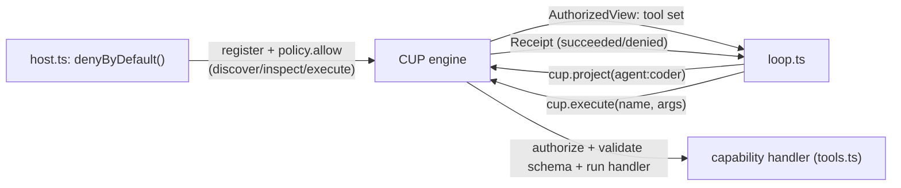
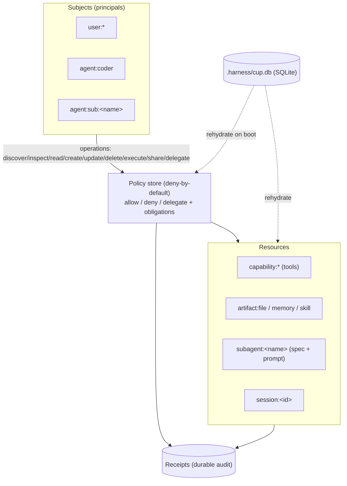
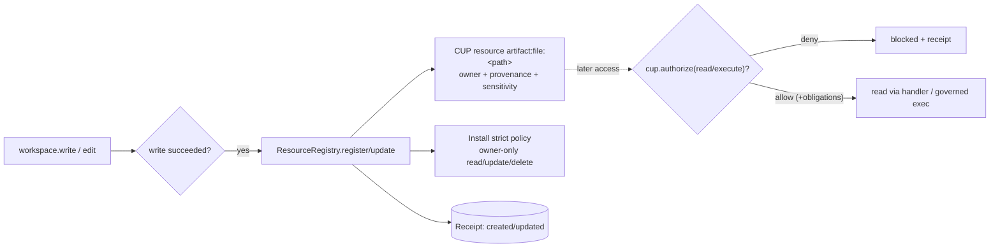
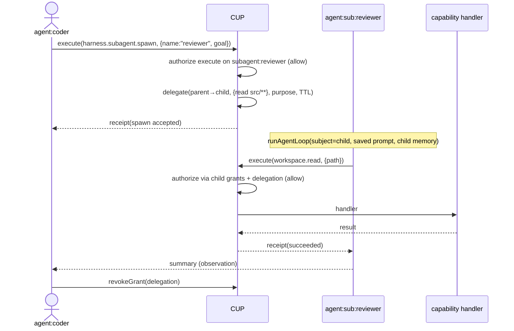

# Plan: CUP as the operating model for the whole agent framework

**Status:** proposal · **Date:** 2026-09-15

Make the [Capability UI Protocol (CUP)](https://github.com/Capability-UI/Capability-UI)
the single data model, permission set, and audit trail for the entire harness:

1. **Everything the agent creates becomes a CUP resource** with strict, deny-by-default policies.
2. **Subagents become first-class, reusable principals** — saved system prompt, subagent-specific memory, and a CUP-scoped capability/resource set — spawnable now and re-launchable in later sessions.
3. **CUP is the operating model** for granting subagents capabilities (via policy + least-privilege delegation) and for governing every action (via receipts).

---

## 1. How the workspace and execution work today

- **Writing.** `workspace.write` / `workspace.edit` go through `Workspace` (`src/workspace.ts`), which confines every path to the workspace root (`assertInside` rejects `..` and absolute escapes). So file *reads/writes/globs/greps* are jailed.
- **Executing saved code.** Yes — the agent can run whatever it writes. It writes e.g. `solve.py`, then calls `workspace.bash {command: "python3 solve.py"}`. `runBash` (`src/fs-tools.ts`) spawns **`bash -lc <command>` with `cwd = workspace.root`, the full inherited `process.env`, and a 30s timeout** (`BASH_TIMEOUT_MS`). This is the harness's Turing-complete escape hatch: build, run tests, execute generated programs.
- **Important gap.** `workspace.bash` is **not** sandboxed the way the file tools are: it is a real login shell, so a command can read outside the workspace (`cat /etc/passwd`), and it **inherits the full environment, including secrets** like `OPENAI_API_KEY`. Only the *file* capabilities enforce the jail; execution does not. Locking this down is a core motivation for this plan.

### How CUP is used by the agent protocol today

- `host.ts` builds a **deny-by-default** CUP, `register`s each coding capability, and `policy.allow`s `agent:coder` to `discover`/`inspect`/`execute` them.
- `loop.ts` calls `cup.project()` to get the authorized tool set, then routes every tool call through `cup.execute()` — which authorizes, validates input against the capability's `inputSchema`, runs the handler, and emits a **receipt**.
- **What CUP governs today:** only *capabilities* (tools). **What it does not:** the files/memory/skills/sessions the agent produces are plain workspace state with no resource identity, no per-artifact policy, and no receipts. This plan closes that gap.

### Where is the database today? (there isn't one)

There is **no database** in the current system. Two layers of state, both non-DB:

- **CUP runtime** is purely **in-memory**: `host.ts` calls `denyByDefault()`, whose engine keeps resources, policies, action tokens, delegations, and receipts (`MemoryReceiptSink`) in RAM. All of it is lost when the process exits.
- **Harness state** is **flat files** under `.harness/` (`prompt.md`, `progress.md`, `memory.json`, `feature_list.json`, `sessions/*.jsonl`, `skills/`, `agents/`).

CUP core *does* define a persistence seam — the `CupPersistence` and `SqlClient` interfaces in `persistence.ts` — but the only concrete implementation shipped is **Postgres** (`PostgresPersistence` + `CUP_POSTGRES_SCHEMA`, mirrored by `sql/001_cup_initial.sql`), and **nothing in the harness uses it**. So resources, policies, and receipts have nowhere durable to live.

**Decision: use SQLite, not Postgres.** This plan introduces a single **SQLite** database at `.harness/cup.db` as the durable store for the CUP model (resources, policies, delegations, receipts, subagent specs). SQLite fits a per-workspace, single-process agent far better than Postgres: no server, one file, trivial backup/versioning, and Node's built-in `node:sqlite` (`DatabaseSync`) means **zero new dependencies**. The `SqlClient`/`CupPersistence` interfaces are DB-agnostic, so this is an additive backend, not a rewrite.

---

## 2. Target model: CUP everywhere

Model every first-class entity as a CUP **subject** or **resource**, governed by **policies**, audited by **receipts**, persisted across sessions.

**Concept → CUP construct mapping:**

| Harness concept | CUP construct |
| --- | --- |
| Tools | `Capability` resources + `execute` policies (today) |
| Files / dirs the agent creates | `data` resources (`artifact:file:<path>`) with `read` handlers |
| Durable memory / skills / features | `data` resources (`artifact:memory:*`, `skill:*`, `feature:*`) |
| Sessions | `data` resources (`session:<id>`) |
| Subagents | subject `agent:sub:<name>` **and** resource `subagent:<name>` (its spec/prompt) |
| "who may do what" | Policies (`allow`/`deny`, priorities, scope, obligations) |
| Parent → child least-privilege | `delegate()` grants (purpose, operations, scope, expiry, revoke) |
| Audit / provenance | Receipts (persisted `ReceiptSink`) |
| Sensitive-field handling | Obligations: `redact`, `require_confirmation`, `human_review`, `write_receipt` |
| Durable persistence | **SQLite** `.harness/cup.db` via `CupPersistence` (subjects, resources, policies, delegations, receipts) |

---

## 3. Part A — Every artifact the agent creates is a CUP resource

### A.1 Resource registry
Add a `ResourceRegistry` (new `src/resources.ts`) that the write-path capabilities call after a successful mutation. For each created/updated artifact it `register`s (or version-bumps) a CUP `Resource`:

- **id:** `artifact:file:<relpath>` (path-addressed) — optionally also a content hash in metadata for lineage.
- **type:** `data`; **version:** bumped on each update; **sensitivity:** classified (default `confidential`; raise to `restricted` when a secret-scan flags the content).
- **owner:** the acting subject id (`agent:coder` or `agent:sub:<name>`).
- **description / schema:** file kind + metadata schema.
- **metadata (provenance):** `{ createdByReceiptId, capabilityId, sessionId, path, bytes, contentHash, createdAt, updatedAt }`.
- **read handler:** returns the artifact content through the jailed `Workspace` (so reads are policy-checked *and* path-safe).

### A.2 Strict default policy on creation
On registration, install least-privilege policies:

- `allow(owner, [read, update, delete], resource)` — the creator manages its own artifact.
- **No** grant for anyone else → deny-by-default keeps artifacts private until explicitly `share`d/`delegate`d.
- Sensitivity-driven **obligations**: `restricted` artifacts attach `require_confirmation` (or `human_review`) before `read`/`execute`; secret-bearing artifacts attach `redact` on `read`.
- Every create/update/delete emits a **receipt**, so "everything the agent made" has complete lineage.

### A.3 Governed execution (bring `bash` under CUP)
Introduce `workspace.exec { resourceId, args? }` that runs a **registered code artifact** under policy instead of an arbitrary string:

- Authorizes `execute` on the artifact resource (deny-by-default; must be granted + marked executable).
- Runs it in a **constrained sandbox**: dedicated cwd, **scrubbed env** (drop `OPENAI_*` and other secrets), no network unless a `net:*` resource is granted, CPU/mem/time limits, output capped like today.
- Emits a receipt tying the run to the code resource.

Keep raw `workspace.bash` only behind a high-risk capability with a `human_review`/`require_confirmation` obligation (or disable it entirely in "strict mode"). This directly answers "can it execute saved code?" — **yes, but as a governed CUP action with a sandbox**, not an unaudited shell inheriting secrets.

---

## 4. Part B — Reusable, spawnable subagents

### B.1 Persisted subagent definition
Stored under `.harness/agents/<name>/`:

- `spec.json` — `{ id: "agent:sub:<name>", displayName, model?, grants: [{capability, operations}], resourceScopes: [...], memoryNamespace, sensitivityCeiling, spawnableBy: [subjectIds], createdAt, updatedAt }`.
- `prompt.md` — the subagent's **saved system prompt**, reused verbatim on every launch.
- `memory/` — a subagent-scoped `.harness`-style state tree (`prompt.md`/`progress.md`/`memory.json`/`feature_list.json`/`skills/`/`sessions/`), so **memories are subagent-specific** and accumulate across sessions.

### B.2 Each subagent is a CUP subject with its own capability set
- Register the subagent as subject `agent:sub:<name>` and as resource `subagent:<name>`.
- Its capability set is **pure CUP policy**: `policy.allow(agent:sub:<name>, execute, <capability>)` for **only** the granted tools; deny-by-default gives it nothing else. → *CUP is the operating model for what a subagent can do.*
- Its resource access is likewise policy: `allow(agent:sub:<name>, [discover,inspect,read], <resource/scope>)` for only the artifacts/paths it may touch.

### B.3 Spawning as a governed, least-privilege operation
New capability `harness.subagent.spawn { name, goal, delegate? }`:

1. Authorize the **parent** to `execute` the `subagent:<name>` resource (so not every agent can spawn every subagent).
2. Optionally **delegate** a scoped subset of the parent's own authority to the child: `cup.delegate({ from: parent, to: child, capability, operations, scope, purpose, expiresInMs })` — time-boxed, purpose-bound, and revocable via `revokeGrant`. This is least-privilege handoff.
3. Launch a nested `runAgentLoop` with `subject = agent:sub:<name>`, `prompt = <saved subagent prompt>`, state loaded from the subagent's `memory/` namespace, and a CUP view restricted to the child's grants (+ delegated grants).
4. The child's tool calls run through the same `cup.execute`, producing receipts **under the child subject**. The result returns to the parent as an observation + receipt; the delegation is revoked on completion/expiry.

### B.4 Reuse across sessions
Because spec + prompt + memory persist, a later top-level session re-launches the **same** subagent identity with its accumulated memory:

- CLI: `harness subagent create <name> --prompt <file> [--allow cap1,cap2]`, `harness subagent run <name> "<goal>"`.
- Programmatic: the parent agent calls `harness.subagent.spawn`.

Isolation guarantees: the child's memory namespace is separate; it **cannot** read parent memory or ungranted artifacts; its capability set is its own; every action is receipted under its subject.

---

## 5. Part C — CUP as the operating model for capabilities

Parts A/B make CUP the substrate for authority everywhere:

- **Granting a subagent capabilities** = adding `execute` policies for its subject (or delegating from a parent). Revoking = removing the policy / `revokeGrant`.
- **Resource availability** = `read`/`inspect` policies + delegation scope; nothing is visible or usable without an explicit allow.
- **Every action** (tool call, artifact read, code execution, spawn) = a `cup.execute`/`authorize` with a receipt.
- **Obligations** enforce guardrails uniformly: confirmation/human-review for destructive or `restricted` operations, redaction for sensitive reads, receipts always.

---

## 6. Cross-cutting concerns

- **Persistence (SQLite).** CUP is in-memory today (`denyByDefault()`), so resources/policies/receipts vanish between runs. Introduce a single **SQLite** database at `.harness/cup.db` as the durable store:
  - Implement a SQLite `SqlClient` over Node's built-in **`node:sqlite`** (`DatabaseSync`, zero deps; `better-sqlite3` is a drop-in alternative if a compiled driver is preferred), and a **`SqliteCupPersistence`** implementing the existing `CupPersistence` interface, plus a **`CUP_SQLITE_SCHEMA`** (SQLite DDL: `TEXT`/`INTEGER`, JSON stored as `TEXT`, ISO-8601 timestamps — no `jsonb`/`timestamptz`/`pgcrypto`). These land in CUP core alongside the Postgres versions; Postgres stays available for multi-host deployments.
  - Back the `CapabilityUI` `ReceiptSink` with the same DB so every receipt is appended to `.harness/cup.db`.
  - On boot, load subjects/resources/policies/delegations from SQLite into the in-memory engine (SQLite is the durable store; the in-memory engine remains the hot path). Use WAL mode and treat the single agent process as the sole writer; migrations are versioned SQL files applied at open.
- **Backward compatibility.** Ship behind flags (`CUP_STRICT=1`, `CUP_GOVERNED_EXEC=1`). Phase 1 is audit-only (register resources + receipts without blocking) so nothing breaks; enforcement turns on later.
- **Security hardening.** Sandbox governed exec (env scrub, fs/network limits, rlimits); classify sensitivity (secret scan) to drive obligations; keep action-token TTLs.
- **Testing.** Unit: registry create/version, deny-by-default artifact privacy, owner-only access, delegation grant/scope/expiry/revoke, subagent isolation (child cannot reach ungranted resources), sandboxed exec (secrets absent, path escape blocked). Integration: end-to-end spawn of a subagent; reuse across two sessions with growing subagent memory; a receipt-lineage assertion for a created-then-executed artifact.

## 7. Phases

1. **Audit foundation (SQLite)** — add `SqliteCupPersistence` + `CUP_SQLITE_SCHEMA` and a SQLite-backed `ReceiptSink` writing to `.harness/cup.db`; add the `ResourceRegistry` and register artifacts on write (non-enforcing).
2. **Strict artifact policies** — owner-only defaults, sensitivity classification, obligations; enforce reads through resource `read` handlers.
3. **Governed execution** — `workspace.exec` over registered code resources + sandbox; gate/disable raw `bash`.
4. **Subagent persistence & subjects** — spec/prompt/memory layout; register subjects + capability policies; `harness subagent create|run`.
5. **Spawn + delegation** — `harness.subagent.spawn`; least-privilege delegation with revoke; per-subagent memory across sessions.
6. **CUP-everywhere** — model skills/sessions/features as resources in `.harness/cup.db`; consolidate all durable state in SQLite (Postgres remains an optional backend for multi-host).

## 8. Open questions / risks

- **Resource identity:** path-addressed (`artifact:file:<path>`) vs content-addressed (`artifact:<sha>`) — path is stable/editable, content gives lineage; likely both (id by path, hash in metadata).
- **Registration overhead:** many small writes → many resources; batch and cap, and consider directory-level resources.
- **Sensitivity classification:** how aggressively to auto-flag secrets; false positives vs leak risk.
- **Sandbox implementation:** env-scrub + cwd + rlimits first; `bubblewrap`/`nsjail` for stronger isolation later.
- **Delegation UX:** default scope a spawn hands down; explicit vs inferred from the child's grants.
- **Migration:** existing workspaces have unregistered artifacts — lazily register on first access.
- **SQLite driver:** `node:sqlite` is built-in but currently emits an experimental warning; `better-sqlite3` avoids that at the cost of a native build. Pick one behind the `SqlClient` seam so it can be swapped.
- **Concurrency:** SQLite is single-writer. Fine for one agent process; if subagents run in separate processes, funnel writes through one owner or enable WAL + short-lived transactions and accept serialized writes.
