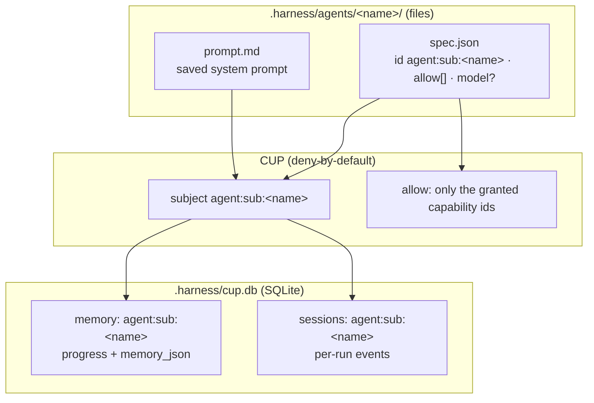
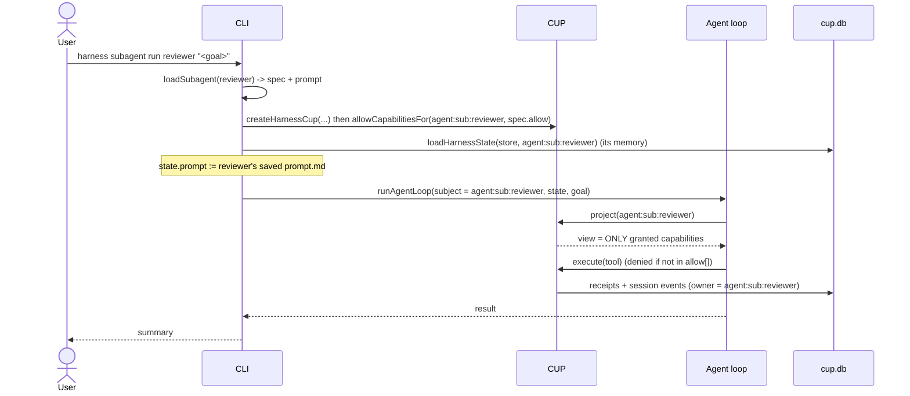
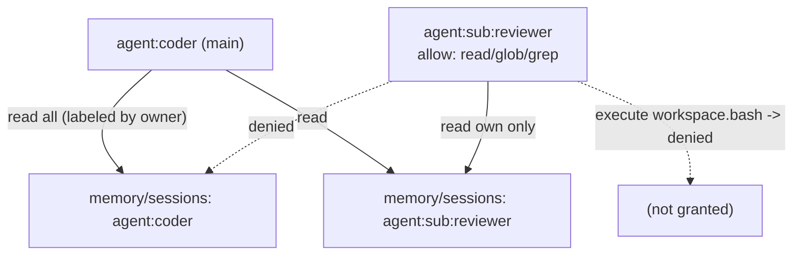

# Subagents

A **subagent** is a reusable, CUP-scoped agent persona. It has:

- a **saved system prompt** (reused verbatim on every launch),
- its own **subject identity** `agent:sub:<name>`,
- its own **memory and sessions** in `.harness/cup.db`, keyed by that subject,
- a **capability set** granted by CUP policy — deny-by-default gives it nothing else.

You define one once and launch it as many sessions as you like; each run resumes
the same persona with its accumulated, isolated memory.

> Implemented today: `subagent create | list | run` (top-level launch), CUP-scoped
> capabilities, subject-keyed memory/sessions, and the read access model. Planned
> follow-ups: in-loop `harness.subagent.spawn` (a running agent spawning a child)
> and least-privilege `delegate()` — see the
> [plan](plans/2026-09-15-001-plan-cup-agent-operating-model.md).

---

## CLI

```bash
# define a reviewer that may only read/search (no write/edit/bash)
harness subagent create reviewer --prompt ./reviewer-prompt.md \
  --allow workspace.read,workspace.glob,workspace.grep

# list saved subagents and their allowed capabilities
harness subagent list

# launch it as its own session (its saved prompt + its own memory)
OPENAI_API_KEY=... harness subagent run reviewer "review src/ for missing error handling"
```

`--allow` defaults to a read-mostly set (`workspace.read/glob/grep`,
`harness.memory.read/append_progress`, `harness.skill.read`,
`harness.features.read`) when omitted.

## Anatomy



- **Definition** (`spec.json` + `prompt.md`) lives in files under `.harness/agents/<name>/`.
- **Memory & sessions** live in `cup.db`, owned by `agent:sub:<name>` (see [the store](../src/cup-store.ts)).
- **Authority** is CUP policy: `allowCapabilitiesFor(cup, 'agent:sub:<name>', spec.allow)`.

## How `subagent run` works



The subagent runs as its **own subject**, so its authorized tool view contains only
its granted capabilities, and its memory/sessions/receipts are all owned by
`agent:sub:<name>`.

## Capability scoping & memory access



- **Capabilities:** the subagent's CUP view = exactly its `allow[]`; an ungranted
  call (e.g. `workspace.bash` for a read-only reviewer) returns a `denied` receipt.
- **Memory:** a subagent reads only its own memory/sessions; the main agent may read
  any subject's (labeled by owner). Enforced by `assertCanRead(requester, owner)` in
  `src/cup-store.ts` (allow iff `requester === owner` or `requester === 'agent:coder'`).

## Files & APIs

| Path | Role |
| --- | --- |
| `src/subagent.ts` | `SubagentSpec`, `subagentSubject`, `createSubagent`, `loadSubagent`, `listSubagents`, `DEFAULT_SUBAGENT_ALLOW` |
| `src/host.ts` | `allowCapabilitiesFor(cup, subjectId, capabilityIds)` — grants a subject exactly those capabilities |
| `src/cup-store.ts` | subject-keyed memory/sessions + access model in `.harness/cup.db` |
| `.harness/agents/<name>/` | `spec.json` + `prompt.md` |

## Roadmap (from the plan)

- **In-loop spawn:** a `harness.subagent.spawn { name, goal }` capability so a running
  agent can launch a child mid-task.
- **Least-privilege delegation:** the parent hands the child a scoped, time-boxed,
  revocable subset of its authority via CUP `delegate()` / `revokeGrant()`.
- **Optional global scope:** promote a subagent (definition and/or memory) to a shared
  `~/.harness` store so the same persona is reusable across projects.

See [CUP as the operating model](plans/2026-09-15-001-plan-cup-agent-operating-model.md).
