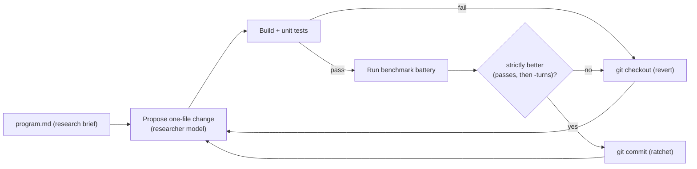

# research/ — autoresearch loop & benchmarks

A self-improvement harness for the agent-harness, modeled on Andrej Karpathy's
[autoresearch](https://github.com/karpathy/autoResearch) ratchet: **propose one
change → build → run unit tests → run a fixed evaluator → keep the change only if
the metric strictly improves, otherwise revert.** Every accepted change is a git
commit; nothing that fails to build, breaks a test, or fails to improve is kept.



## Files

| Path | Role |
| --- | --- |
| `program.md` | The research brief: the metric, what may change, and hard constraints. |
| `loop.mjs` | The git-ratchet driver (propose → build → test → eval → keep/revert). |
| `eval/run.mjs` | Fixed evaluator: runs a battery through the real `harness run` loop and prints one JSON metric. |
| `eval/battery.mjs` | `battery` — quick synthetic smoke tasks. |
| `eval/hard.mjs` | `hard` — tight-budget synthetic tasks (edit-uniqueness, large-file, refactors, masking recall). |
| `eval/humaneval.mjs` | `humaneval` — the real HumanEval benchmark (python3). |
| `eval/humanevalplus.mjs` | `humanevalplus` — HumanEval with stricter EvalPlus tests (python3 + numpy). |
| `eval/multipl_ts.mjs` | `multiplts` — HumanEval translated to TypeScript, graded via `tsx`. |
| `eval/fetch-humaneval.mjs` | Cache a HumanEval subset from HuggingFace. |
| `eval/fetch-benchmark.mjs` | Generic HuggingFace datasets-server fetcher (dataset/config/split/count). |
| `eval/data/*.json` | Cached benchmark data (committed for reproducibility). |
| `results*.tsv` | Recorded ratchet runs (audit trail). |

## The metric

`eval/run.mjs` prints a single JSON object, e.g.:

```json
{ "battery": "humaneval", "model": "…", "passes": 10, "total": 10, "totalTurns": 42, "tasks": [ … ] }
```

- `passes` — number of tasks whose deterministic grader passed (**primary**, higher is better).
- `totalTurns` — sum of agent turns across tasks (**tie-breaker**, lower is better when `passes` is equal).

`loop.mjs` accepts a proposal only when it (a) builds, (b) keeps every existing unit
test green, and (c) strictly improves `(passes, -totalTurns)`.

## Quick start

Score the current harness on a benchmark (the solver model is your `OPENAI_*` env):

```bash
# real HumanEval, first 10 problems
EVAL_BATTERY=humaneval HUMANEVAL_N=10 node research/eval/run.mjs

# HumanEval+ (stricter tests; needs python3 + numpy)
EVAL_BATTERY=humanevalplus HUMANEVALPLUS_N=12 node research/eval/run.mjs

# MultiPL-E TypeScript (graded with tsx)
EVAL_BATTERY=multiplts MULTIPL_TS_N=10 node research/eval/run.mjs
```

Run the ratchet loop (researcher **and** solver use `OPENAI_MODEL`):

```bash
EVAL_BATTERY=multiplts RESEARCH_ITERATIONS=4 node research/loop.mjs
```

## Configuration

| Env var | Used by | Default | Purpose |
| --- | --- | --- | --- |
| `OPENAI_API_KEY` / `OPENAI_BASE_URL` / `OPENAI_MODEL` | loop + evaluator | — / OpenAI / `gpt-4.1-mini` | Provider for the researcher and the solver. |
| `EVAL_BATTERY` | `eval/run.mjs` | `battery` | `battery` \| `hard` \| `humaneval` \| `humanevalplus` \| `multiplts`. |
| `HUMANEVAL_N` / `HUMANEVALPLUS_N` / `MULTIPL_TS_N` | batteries | 20 / 12 / 15 | How many problems to run. |
| `*_MAX_TURNS` | batteries | 6 | Per-task turn budget (`HUMANEVAL_MAX_TURNS`, etc.). |
| `EVAL_TASK_TIMEOUT_MS` | `eval/run.mjs` | 240000 | Per-task wall-clock cap. |
| `RESEARCH_ITERATIONS` | `loop.mjs` | 6 | Number of propose/eval cycles. |
| `RESEARCH_TARGETS` | `loop.mjs` | `src/loop.ts,src/tools.ts,src/context.ts,src/provider.ts` | Source files the researcher may rewrite (one per iteration, round-robin). |

## Requirements

- Node.js >= 20 (built-in `fetch`, `node --test`).
- `python3` for `humaneval`; `python3` + `numpy` for `humanevalplus`.
- `tsx` (already a dev dependency) for `multiplts`.
- Network access to `datasets-server.huggingface.co` **only** when (re)fetching data;
  runs use the committed caches under `eval/data/`.

## Adding a benchmark

1. Fetch and cache a subset:
   `node research/eval/fetch-benchmark.mjs <dataset> <config> <split> <count> data/<name>.json`
2. Add a battery module under `eval/` that maps each cached row to a task
   (`{ name, maxTurns, prompt, setup(dir), grade(dir, execFileP) }`) with a
   deterministic grader.
3. Register it in the `ALLOWED_BATTERIES` map in `eval/run.mjs`.

## Integrity & safety

- The evaluator, its batteries, cached data, and graders are **read-only** to the
  loop — never let a proposal edit `research/eval/**`. The driver only writes the
  single source file it is iterating on.
- The ratchet's `passes`/`turns` signal can be noisy for a given model; treat an
  accept driven by a tiny turn delta as noise and review the committed diff before
  relying on it (see `results*.tsv` for real runs, which include reverts and
  regression rejections).
- Do not weaken the workspace jail or the deny-by-default policy in any proposal.
